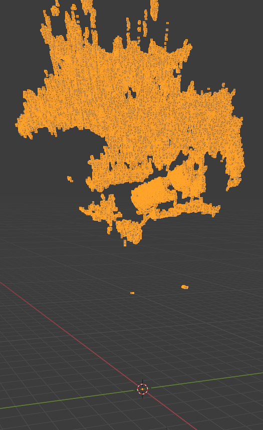
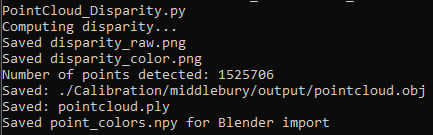
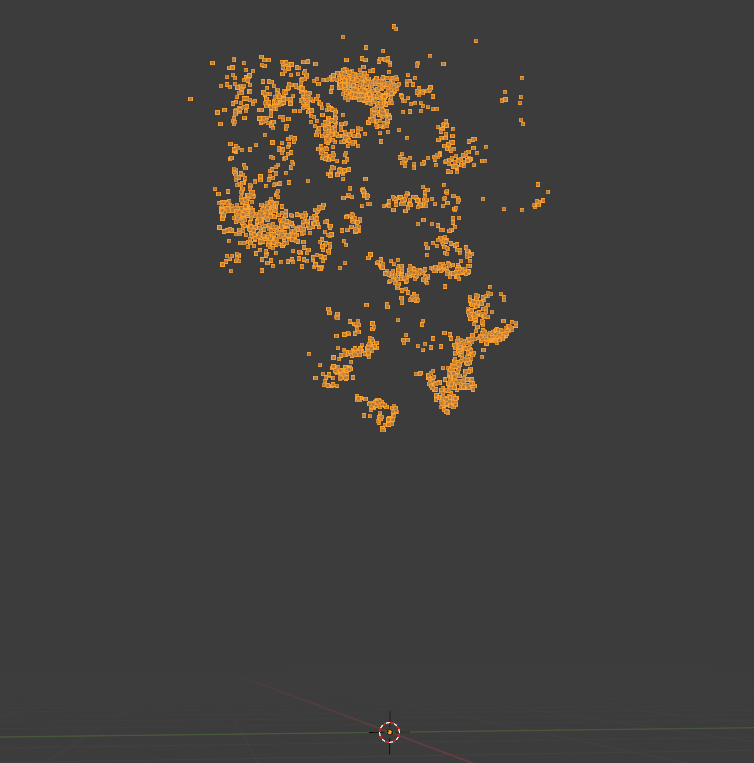
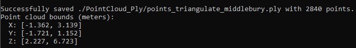

# Test Results: Disparity VS Triangulate

## Disparity Method (Dense Reconstruction)

### Blender 3D Visualization
 

### Point Statistics
 

**Result:** 1,525,706 points detected - creates a complete, solid 3D representation of the object with full surface coverage.

---

## Triangulation Method (Sparse Reconstruction)

### Blender 3D Visualization    
    

### Point Statistics
 

**Result:** Only 2,840 points detected - captures key features but lacks surface detail.

---

## Comparison

| Method | Points | Reconstruction Quality | Use Case |
|--------|--------|------------------------|----------|
| **Disparity** | 1,525,706 | Dense, complete surfaces | Object modeling, scene reconstruction |
| **Triangulation** | 2,840 | Sparse feature points | Feature tracking, quick pose estimation |

## Conclusion

The disparity method produces a significantly denser point cloud (500x more points), resulting in a complete 3D model with full surface coverage. The triangulation method only captures distinctive feature points, creating a sparse outline rather than a solid reconstruction. 

**Choose disparity for:** Detailed 3D models, surface reconstruction, visualization  
**Choose triangulation for:** Fast processing, feature tracking, camera pose estimation

## Sources
[Images Used](https://vision.middlebury.edu/stereo/data/scenes2021/)